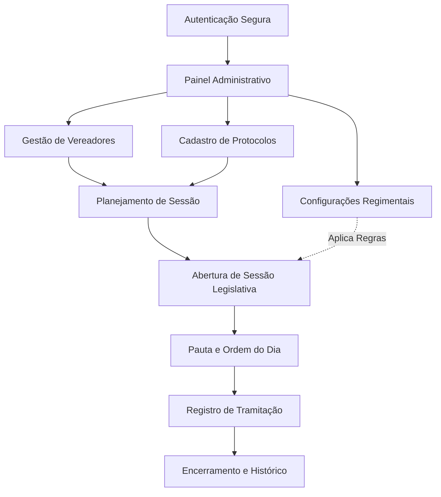

@@ -1,150 +1,199 @@
# DGPRO | Sistema Digital de Votação Legislativa
# SDV | Sistema Digital de Votação Legislativa


> **Solução GovTech para modernização, transparência e automação do processo legislativo municipal.**
> **Solução GovTech para modernização, transparência e automação do processo
> legislativo municipal.**

---

## 🏛️ Sobre o Projeto
## Sobre o projeto

O **DGPRO** é uma plataforma Fullstack desenvolvida para transformar a forma como Câmaras Municipais realizam suas sessões de votação. Mais do que um CRUD, o sistema resolve dores críticas da gestão pública: **erros na contagem manual de votos, falta de transparência em tempo real e excesso de burocracia física.**
O **SDV** é uma plataforma *fullstack* desenvolvida para transformar a forma
como Câmaras Municipais realizam suas sessões de votação. Mais do que um
CRUD, o sistema resolve dores críticas da gestão pública: **erros na
contagem manual de votos, falta de transparência em tempo real e excesso de
burocracia física.**

### 🌟 Problemas Reais que Resolve:
- **Contagem de Votos Auditável:** Automatiza o cálculo de quórum e resultados com base no regimento interno.
- **Transparência Legislativa:** Histórico digital e imediato de como cada parlamentar votou.
- **Economia de Recursos:** Redução drástica de papel com a digitalização de pautas e protocolos.
- **Conformidade com Regimentos:** Configurações flexíveis para o voto da presidência (voto de minerva ou participação plena).
### Problemas reais que resolve

- **Contagem de votos auditável:** automatiza o cálculo de quórum e dos
  resultados com base no regimento interno.
- **Transparência legislativa:** histórico digital e imediato de como cada
  parlamentar votou.
- **Economia de recursos:** redução drástica do uso de papel com a
  digitalização de pautas e protocolos.
- **Conformidade com regimentos:** configurações flexíveis para o voto da
  presidência (voto de minerva ou participação plena).

---

## 🚀 Tecnologias Utilizadas
## Tecnologias utilizadas

### Frontend
- **React.js + TypeScript:** Interface reativa e tipagem estrita para maior segurança.
- **Tailwind CSS:** Estilização moderna e responsiva.
- **Vite:** Ferramenta de build ultra-rápida.
- **Zustand:** Gerenciamento de estado global leve e eficiente.

- **React.js + TypeScript:** interface reativa e tipagem estrita para maior
  segurança.
- **Tailwind CSS:** estilização moderna e responsiva.
- **Vite:** ferramenta de build ultrarrápida.
- **Zustand:** gerenciamento de estado global leve e eficiente.

### Backend

- **Node.js + Express:** API RESTful robusta e escalável.
- **MySQL:** Banco de dados relacional para garantir a integridade dos dados legislativos.
- **JWT (JSON Web Token):** Autenticação segura de usuários.
- **Bcrypt:** Criptografia de senhas seguindo as melhores práticas de segurança.
- **MySQL:** banco de dados relacional para garantir a integridade dos dados
  legislativos.
- **JWT (JSON Web Token):** autenticação segura de usuários.
- **Bcrypt:** criptografia de senhas seguindo as melhores práticas de
  segurança.

### Infraestrutura & Ferramentas
- **Docker & Docker Compose:** Containerização de toda a stack para deploy consistente em qualquer ambiente.
- **Axios:** Integração fluida entre Frontend e API.
### Infraestrutura e ferramentas

- **Docker & Docker Compose:** containerização de toda a stack para deploy
  consistente em qualquer ambiente.
- **Axios:** integração fluida entre frontend e API.

---

## 🛠️ Funcionalidades Principais
## Funcionalidades principais

- [x] **Gestão de Parlamentares:** Cadastro completo com partido e cargos na Mesa Diretora.
- [x] **Controle de Sessões:** Criação de sessões ordinárias e extraordinárias com controle de status (Aberta, Em Andamento, Encerrada).
- [x] **Tramitação de Protocolos:** Gestão de Projetos de Lei, Requerimentos e Indicações com suporte a anexos PDF.
- [x] **Painel de Votação em Tempo Real:** Interface para registro de votos com apuração automática de resultados.
- [x] **Regras de Negócio Customizáveis:** Configuração dinâmica de comportamento de voto para o Presidente da Casa.
-  **Gestão de parlamentares:** cadastro completo, com partido e cargo na
  Mesa Diretora.
-  **Controle de sessões:** criação de sessões ordinárias e
  extraordinárias, com controle de status (Aberta, Em Andamento, Encerrada).
-  **Tramitação de protocolos:** gestão de Projetos de Lei, Requerimentos
  e Indicações, com suporte a anexos em PDF.
-  **Painel de votação em tempo real:** interface para registro de votos
  com apuração automática de resultados.
-  **Regras de negócio customizáveis:** configuração dinâmica do
  comportamento de voto do Presidente da Casa.

---

## 🔄 Fluxo de Funcionamento do Sistema
## Fluxo de funcionamento do sistema

O SDV foi projetado para seguir o rito legislativo real, garantindo que
cada etapa da sessão seja documentada e configurável.

O DGPRO foi projetado para seguir o rito legislativo real, garantindo que cada etapa da sessão seja documentada e configurável.
### Diagrama de processo

### Diagrama de Processo

## 📸 Demonstração

### Tela de Login
## Demonstração

### Tela de login

<p align="center">
  
</p>

### Tela hero
### Tela inicial

<p align="center">
  
  
</p>

### Detalhamento das Etapas

1. **Gestão de Parlamentares:** Cadastro completo de vereadores, incluindo foto, partido e cargo ocupado na Mesa Diretora (Presidente, Secretário, etc.).
2. **Tramitação de Protocolos:** Registro de Projetos de Lei, Requerimentos e Indicações com definição de **Ementa** e **Rito de Votação** (Maioria Simples, Absoluta ou 2/3).
3. **Configurações Dinâmicas:** Adaptabilidade ao regimento interno, permitindo configurar se o Presidente vota em todas as matérias ou apenas em caso de empate (voto de minerva).
4. **Controle de Sessões:** Criação e gestão de sessões ordinárias e extraordinárias, organizadas por exercício e com controle rigoroso de status.
5. **Histórico e Transparência:** Armazenamento relacional que garante a integridade dos dados para futuras gerações de atas e relatórios de transparência.
### Detalhamento das etapas

1. **Gestão de parlamentares:** cadastro completo de vereadores, incluindo
   foto, partido e cargo ocupado na Mesa Diretora (Presidente, Secretário
   etc.).
2. **Tramitação de protocolos:** registro de Projetos de Lei, Requerimentos
   e Indicações, com definição de **ementa** e **rito de votação** (Maioria
   Simples, Absoluta ou 2/3).
3. **Configurações dinâmicas:** adaptação ao regimento interno, permitindo
   configurar se o Presidente vota em todas as matérias ou apenas em caso de
   empate (voto de minerva).
4. **Controle de sessões:** criação e gestão de sessões ordinárias e
   extraordinárias, organizadas por exercício e com controle rigoroso de
   status.
5. **Histórico e transparência:** armazenamento relacional que garante a
   integridade dos dados para futuras gerações de atas e relatórios de
   transparência.

---

## 📦 Como Executar o Projeto
## Como executar o projeto

### Pré-requisitos

- Docker e Docker Compose instalados.

### Passo a Passo
### Passo a passo

1. **Clone o repositório:**

   ```bash
   git clone https://github.com/seu-usuario/sistema-digital-de-votacao.git
   cd sistema-digital-de-votacao
   ```

2. **Suba os containers (Banco de Dados):**
2. **Suba os containers (banco de dados):**

   ```bash
   docker compose up -d
   ```

3. **Configure o Backend:**
3. **Configure o backend:**

   ```bash
   cd backend
   npm install
   # Crie seu arquivo .env com as credenciais do banco
   npm start
   ```

4. **Inicie o Frontend:**
4. **Inicie o frontend:**

   ```bash
   # Em outro terminal, na raiz do projeto
   npm install
   npm run dev
   ```

5. **Dados de Acesso (Default):**
5. **Dados de acesso (padrão):**
   - **Login:** `admin@sdvpro.com.br`
   - **Senha:** `admin123`

---

## 🧠 Desafios Técnicos Superados
- **Lógica de Proxy no Vite:** Configuração de comunicação entre containers Docker e ambiente de desenvolvimento local.
- **Normalização de Banco de Dados:** Modelagem de dados para suportar as complexas relações entre Vereadores, Sessões e Protocolos.
- **Tratamento de Concorrência:** Garantia de que os votos sejam registrados corretamente durante sessões simultâneas.
## Desafios técnicos superados

- **Lógica de proxy no Vite:** configuração da comunicação entre containers
  Docker e o ambiente de desenvolvimento local.
- **Normalização do banco de dados:** modelagem de dados para suportar as
  relações complexas entre vereadores, sessões e protocolos.
- **Tratamento de concorrência:** garantia de que os votos sejam registrados
  corretamente durante sessões simultâneas.

---

## 📄 Licença
Este projeto está sob a licença MIT. Veja o arquivo [LICENSE](LICENSE) para mais detalhes.
## Licença

Este projeto está sob a licença MIT. Veja o arquivo [LICENSE](LICENSE) para
mais detalhes.

---
**Desenvolvido com foco em resolver problemas reais e gerar valor para a sociedade.** 🚀

**Desenvolvido com foco em resolver problemas reais e gerar valor para a
sociedade.** 🚀
